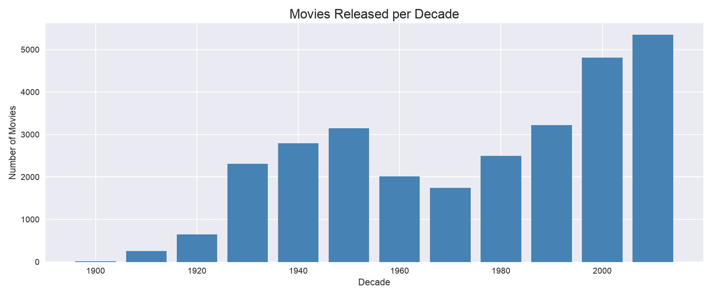
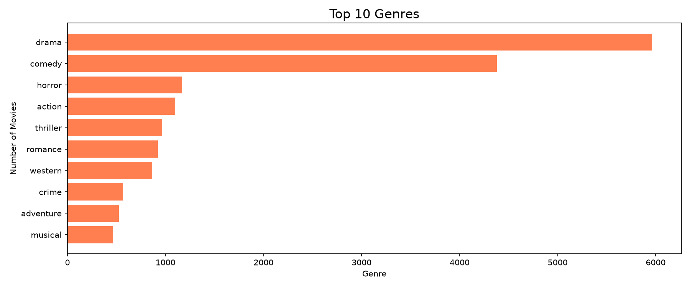
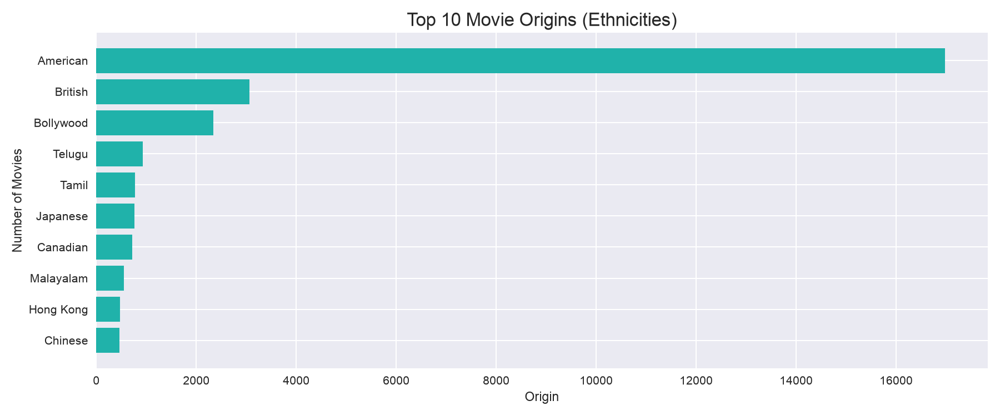
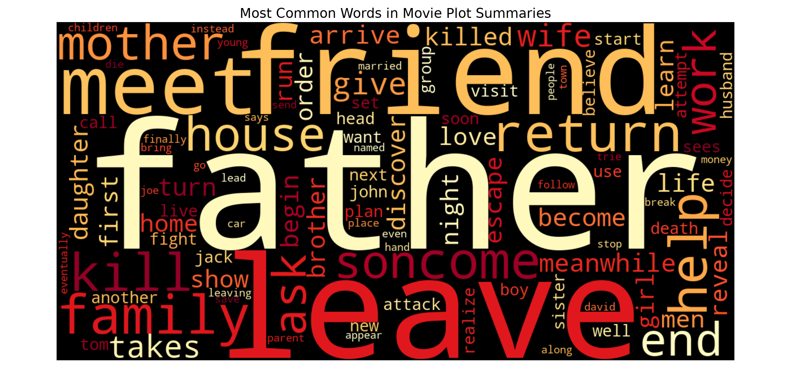
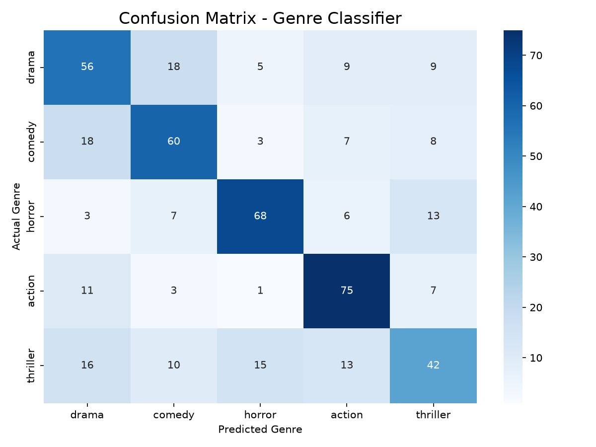
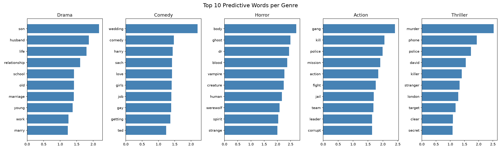

# movie-plots
# Global Cinema Intelligence: NLP & Analytics on Wikipedia Movie Plots

A data science project analyzing 34,886 movie plot summaries from Wikipedia,
combining exploratory data analysis, natural language processing, and machine
learning to try to uncover patterns in global cinema.

## Project Overview

This project was built using the
[Wikipedia Movie Plots dataset](https://www.kaggle.com/datasets/jrobischon/wikipedia-movie-plots)
and is organized into three notebooks:

| Notebook | Description |
|---|---|
| `01_eda.ipynb` | Exploratory Data Analysis — trends, genres, origins |
| `02_nlp_analysis.ipynb` | NLP Analysis — word clouds, most common themes |
| `03_genre_classifier.ipynb` | ML Genre Classifier — TF-IDF + Logistic Regression |

## Key Findings

- **American films dominate** the dataset (17,377 out of 34,886 — ~50%),
followed by British, Bollywood, Tamil, and Telugu cinema
- **Drama and comedy** are the most common genres globally
- **"Father"** is the single most common word across all plot summaries,
highlighting how family relationships are a universal theme in cinema
- **Family** is further reinforced as a universal theme in cinema given that “Love”, “family”, “home”, “mother”, “wife”, “son”, “daughter” are also common words
- **“Police”** also appears high up, suggesting thriller and crime plots may be runners-up
- **Horror and action** are the easiest to classify, with an F1-score of 0.72 each; this may be due to their distinct vocabulary (i.e., “ghost”, “haunted”, “scared” for horror, and “kill”, “fight”, “attack” for action)
- **Thriller** is the most difficult to predict, with an F1-score of 0.48, potentially because the language used in thrillers may heavily overlap with horror and action. 

## Genre Classifier Model Performance

- **Model**: Logistic Regression with TF-IDF features
- **Accuracy**: 62.32% across 5 genres (vs 20% random baseline)
- **Best predicted genre**: Action (F1: 0.72)
- **Hardest genre**: Thriller (F1: 0.48)

## Visualizations

### Movies Released per Decade


### Top 10 Genres


### Top 10 Origins


### Word Cloud of Plot Summaries


### Confusion Matrix


### Top Predictive Words per Genre


## Tech Stack

- **pandas**, **numpy** — data manipulation
- **matplotlib**, **seaborn** — visualizations
- **nltk**, **wordcloud** — natural language processing
- **scikit-learn** — TF-IDF vectorization, Logistic Regression

## How to Run

1. Clone the repo
```bash
   git clone https://github.com/daniel15alv/movie-plots.git
   cd movie-plots
```

2. Create a virtual environment and install dependencies
```bash
   python3 -m venv venv
   source venv/bin/activate
   pip install -r requirements.txt
```

3. Download the dataset from
[Kaggle](https://www.kaggle.com/datasets/jrobischon/wikipedia-movie-plots)
and place `wiki_movie_plots_deduped.csv` in the `data/` folder

4. Run the notebooks in order inside the `notebooks/` folder
